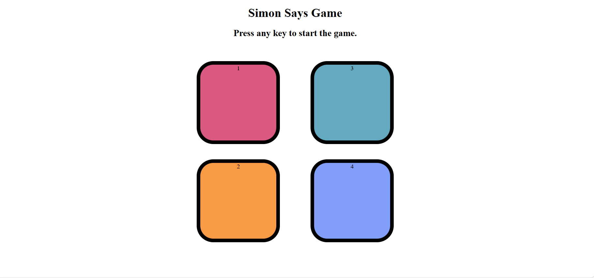

# 🎮 Simon Says Game

A fun and interactive **Simon Says memory game** built with **HTML, CSS, and JavaScript**.  
Test your memory skills by repeating the sequence of flashing colors as the game gets faster and more challenging!  

---

## 📸 Screenshot
  

---

## ✨ Features
- 🎨 Four colorful game buttons 
- 🧠 Increasing difficulty with each level  
- 🏆 Score & high score tracking  
- ❌ Game over animation & restart option  

---

## 🎮 How to Play
1. Press any key to begin.  
2. Watch the sequence of flashing colors.  
3. Repeat the sequence by clicking the buttons in the correct order.  
4. Each round, the sequence gets longer.  
5. The game ends when you make a mistake.  

---

## 🛠 Tech Stack
- **HTML5** – Game structure  
- **CSS3** – Styling & animations  
- **JavaScript (Vanilla)** – Game logic  

---

## 📬 Contact 
- 💼 LinkedIn: [Kanan Preet Kaur](https://www.linkedin.com/in/kanan-preet-kaur/)  
- 🐙 GitHub: [Kanan Preet Kaur](https://github.com/kanan-preet-kaur)  

